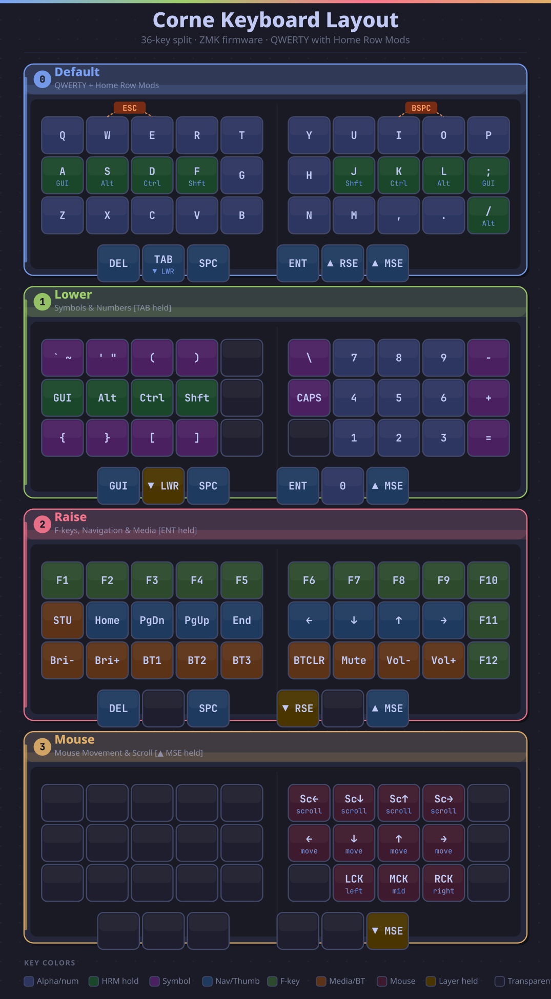

# Corne ZMK Config

Personal ZMK firmware configuration for the **Corne** (crkbd) split keyboard, running on [nice!nano v2](https://nicekeyboards.com/nice-nano) controllers.



## Hardware

| Part | Details |
|------|---------|
| Keyboard | Corne (crkbd) — 36 keys, 3×5 + 3 thumb per side |
| Controller | nice!nano v2 (wireless, USB-C) |
| Firmware | [ZMK](https://zmk.dev) |

## Layout

4 layers, activated by thumb keys:

| # | Layer | Activate |
|---|-------|---------|
| 0 | **Default** — QWERTY + Home Row Mods | *(base)* |
| 1 | **Lower** — Symbols & numpad | Hold `TAB` |
| 2 | **Raise** — F-keys, Nav, Media | Hold `ENT` |
| 3 | **Mouse** — Cursor & scroll | Hold `▲ MSE` |

### Home Row Mods

Modifiers on the home row using `tap-unless-interrupted` hold-tap:

```
A=GUI  S=Alt  D=Ctrl  F=Shift     J=Shift  K=Ctrl  L=Alt  ;=GUI
```

- `require-prior-idle-ms = 125` — prevents misfires during fast typing
- `tapping-term-ms = 170`

### Combos

| Keys | Output |
|------|--------|
| `W` + `E` | `ESC` |
| `U` + `I` | `Backspace` |

## Building

Firmware is built automatically via GitHub Actions on every push. Download the latest `.uf2` files from the [Actions tab](../../actions).

To flash manually:
1. Download `corne_left-nice_nano_v2-zmk.uf2` and `corne_right-nice_nano_v2-zmk.uf2`
2. Double-tap the reset button on a controller — it mounts as a USB drive
3. Copy the matching `.uf2` onto it
4. Repeat for the other half

## ZMK Studio

This config is built with the `studio-rpc-usb-uart` snippet, enabling live keymap editing via [ZMK Studio](https://zmk.dev/docs/features/studio) over USB without reflashing. The `STU` key on the Raise layer (`A` position) unlocks Studio access.

## Files

```
config/
├── corne.keymap   # keymap & layer definitions
├── corne.conf     # firmware settings (BT, power, etc.)
├── corne.overlay  # hardware overrides
└── west.yml       # ZMK dependency manifest
build.yaml         # build matrix (left + right halves)
keyboard-layout.svg / .png
```
